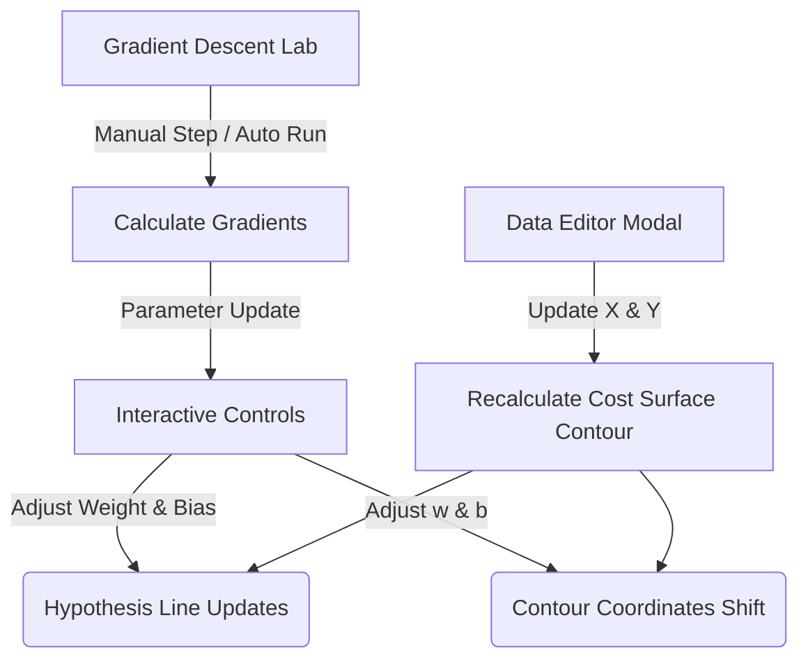

# Mastering the Cost Function: Interactive Linear Regression & Gradient Descent Lab

<div align="center">
  

  [](https://developer.mozilla.org/en-US/docs/Web/HTML)
  [](https://tailwindcss.com/)
  [](https://developer.mozilla.org/en-US/docs/Web/JavaScript)
  [](https://plotly.com/javascript/)
  [](https://mathjs.org/)
  [](https://opensource.org/licenses/MIT)

  **An elegant, real-time, browser-based playground to visualize, manipulate, and master the mathematical foundations of Machine Learning.**
</div>

---

## 🌟 Overview

**Mastering the Cost Function** is an premium interactive simulator built to bridge the gap between abstract mathematical formulas and intuitive visual feedback. Created for educational workshops and individual learners, this tool provides a live, side-by-side exploration of **Linear Regression**, the **Mean Squared Error (MSE) Cost Landscape**, and the optimization process of **Gradient Descent**.

With custom dataset inputs, physical visualization of squared errors, manual parameter controls, and an automated gradient descent step-by-step laboratory, you can see exactly how a machine learning model learns.

---

## 🚀 Key Features

*   **📈 Dynamic Dual-Graph Dashboard:**
    *   **The Hypothesis Model:** Real-time plotting of the regression line $f(x) = wx + b$ against training data.
    *   **The Cost Landscape $J(w,b)$:** High-fidelity 3D-like contour heatmap illustrating the global minimum, updating your parameter coordinates in real-time.
*   **📐 Live Residual Squares Visualizer:**
    *   Toggle **"Show Squared Errors"** to render shaded squares directly on the data plot.
    *   Physically see the "least squares" concept: watch the geometric sizes of the error areas shrink and expand as you tune the model.
*   **🧪 Interactive Gradient Descent Laboratory:**
    *   Configure the **Learning Rate ($\alpha$)** dynamically using custom slider controls.
    *   Execute single optimization steps ($+1$ Step) to inspect incremental movements.
    *   Run **Auto Convergence Mode** to watch the model step-by-step slide down the contour gradient directly into the optimal solution valley.
*   **📊 Dynamic Dataset Customization:**
    *   Built-in dataset editor modal lets you input your own custom $X$ features and $Y$ labels.
    *   The cost contour landscape and model range automatically adapt and recalculate for any dataset size or distribution.
*   **💎 Premium Aesthetic & Micro-animations:**
    *   Stunning slate and indigo glassmorphism layout, sleek interactive slider components, live glowing pulse indicators, and smooth transition-state handling.

---

## 🧮 Mathematical Engine

The core math of this engine replicates the foundational formulas of supervised machine learning algorithms:

### 1. The Hypothesis Model
A simple linear hypothesis represents the predicted values:
$$f_{w,b}(x^{(i)}) = w \cdot x^{(i)} + b$$

### 2. Mean Squared Error (MSE) Cost Function
The dashboard calculates the overall error (cost) $J(w,b)$ as the average squared residual:
$$J(w,b) = \frac{1}{2m} \sum_{i=1}^{m} \left( f_{w,b}(x^{(i)}) - y^{(i)} \right)^2$$
*(where $m$ is the total number of training examples)*

### 3. Gradient Calculation (Partial Derivatives)
To update the weight ($w$) and bias ($b$), the engine computes the slopes of the cost landscape:
$$\frac{\partial J}{\partial w} = \frac{1}{m} \sum_{i=1}^{m} \left( f_{w,b}(x^{(i)}) - y^{(i)} \right) \cdot x^{(i)}$$
$$\frac{\partial J}{\partial b} = \frac{1}{m} \sum_{i=1}^{m} \left( f_{w,b}(x^{(i)}) - y^{(i)} \right)$$

### 4. Gradient Descent Update Rules
At each step, parameters are updated simultaneously towards the negative gradient vector:
$$w \leftarrow w - \alpha \cdot \frac{\partial J}{\partial w}$$
$$b \leftarrow b - \alpha \cdot \frac{\partial J}{\partial b}$$
*(where $\alpha$ is the learning rate)*

---

## 🛠️ Technology Stack & Dependencies

*   **Structure:** Standard `HTML5` with semantic tags.
*   **Style Sheet:** Custom CSS blended with [Tailwind CSS CDN](https://tailwindcss.com/) for fully responsive, utility-first layout management.
*   **Interactions & Physics:** Vanilla ES6+ `JavaScript` for instant rendering cycles.
*   **Plotting Engine:** [Plotly.js (v2.27.0)](https://plotly.com/javascript/) for rendering dual high-performance SVG canvas views with dynamic animation transitions.
*   **Math Computations:** [Math.js (v12.2.0)](https://mathjs.org/) for stable vector operations and matrix evaluations.
*   **LaTeX Math Rendering:** [MathJax v3](https://www.mathjax.org/) for beautiful mathematical typography.

---

## 💻 Quick Start & Running Locally

This application is completely self-contained and client-side—**no installation, database, or server runtime is required.**

### Option A: Local File System
1. Clone or download this repository.
2. Double-click `index.html` to open the interactive dashboard directly in any modern browser.

### Option B: Local Development Server
To ensure smooth network load times for external CDNs, run a local static server:
```bash
# Using python (standard on most machines)
python -m http.server 8000

# Using Node.js npm (live-server or serve)
npx serve .
```
Then navigate your browser to `http://localhost:8000` or `http://localhost:3000`.

---

## 🎨 Interactive User Interface Walkthrough



1.  **Hypothesis Canvas:** Adjust $w$ and $b$ to see how the purple regression line moves. Active residuals are marked in red dashed lines. Shaded red blocks map the squared cost.
2.  **Contour Landscape:** Represents the MSE cost. Dark blue corresponds to lower cost (valleys), while bright yellow indicates high loss peaks. The red dot represents the model's active state.
3.  **Manual Control Panel:** Fine-tune parameter slopes, toggles residual square approximations, and shows active parameter readings.
4.  **Descent Lab:** Set learning rate $\alpha$, trigger single steps, or run auto-descent. The dotted white path on the contour plot records your training progress.
5.  **Metrics Board:** Read live cost outputs and gradients $\frac{\partial J}{\partial w}$ and $\frac{\partial J}{\partial b}$ to watch convergence mathematically approach $0$.

---

## 🎓 About the Author & Credits

Designed and maintained by **Gurnoor Singh** for educational workshops and demonstrations in machine learning fundamentals. 

*   *Contributions and feature ideas are welcome! Feel free to fork this project, open pull requests, or file issues.*
*   *Designed to make machine learning principles accessible, visual, and engaging.*

